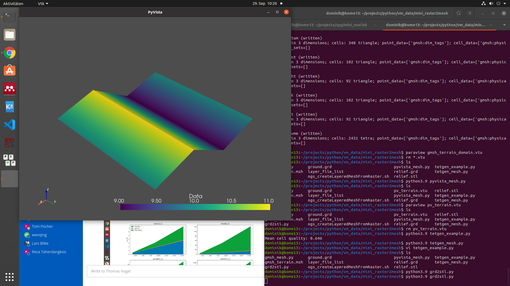
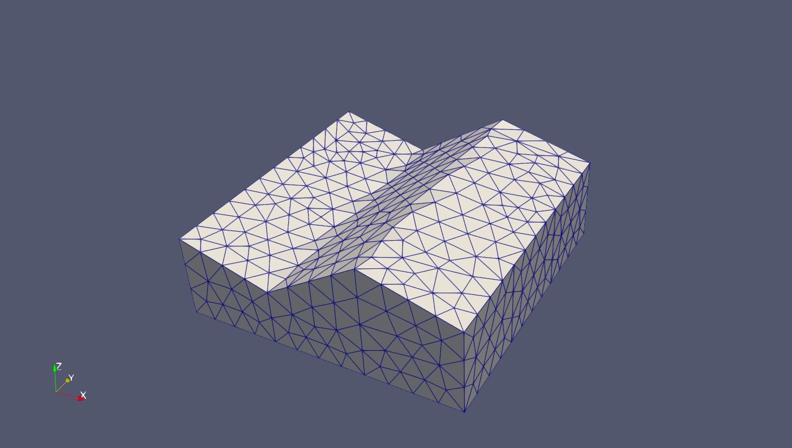
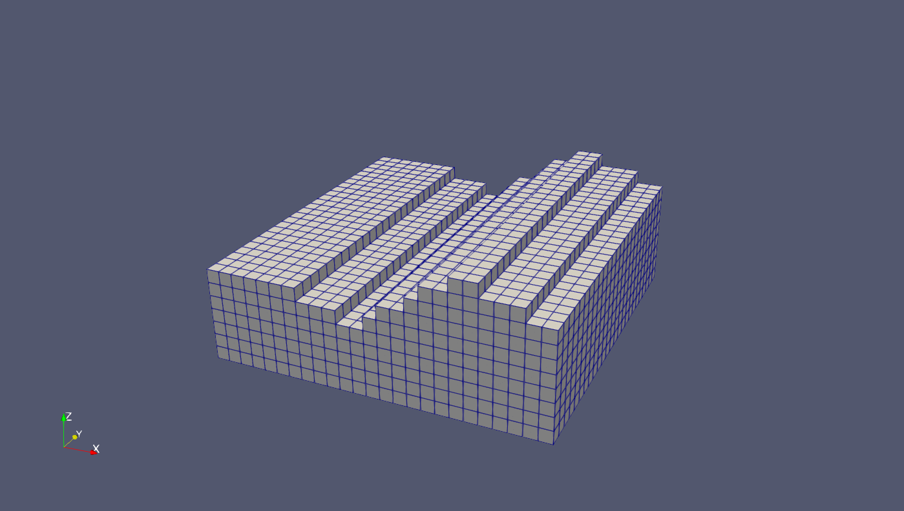
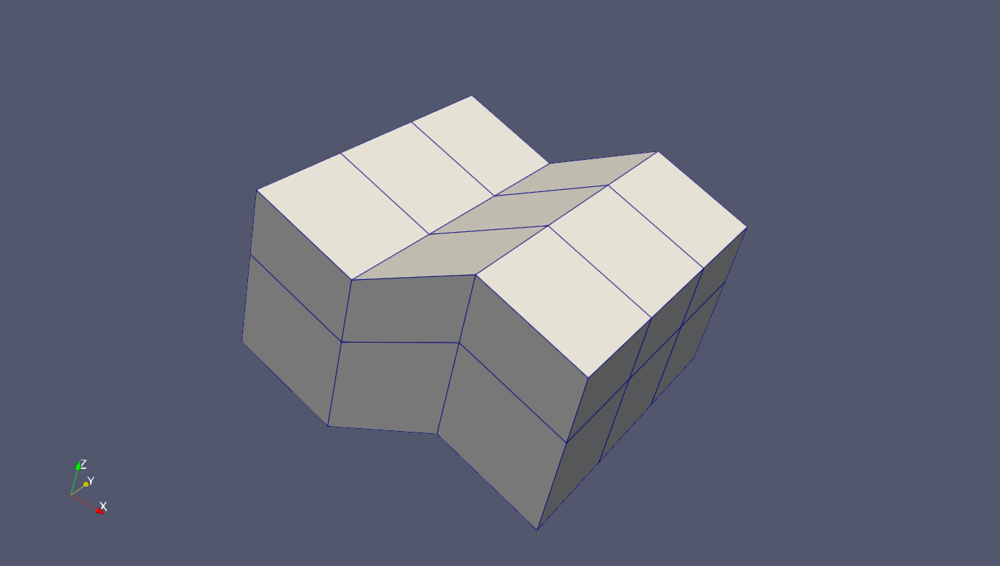

# Terrain meshing
Here we show different tools to mesh a minimum example of a terrain, given by raster data.
These are
- *gmsh*
- *ogs utilities*
- *pyvista*
- *tetgen*


## Gmsh
If the relief is given as relief.grd, then we need to convert it first (file names are hard coded)
``python3 grd2stl.py``.

Running ``python3 gmsh_mesh.py`` reads in relief.stl and meshes the volume between the relief and a *z*-coordinate specified in the script.
In addition it creates physical groups for all bounding surfaces. 



## OGS Utilities

OGS comes with some utilities for meshing. Required are raster files (_*.grd_) and a file specifying their sequence (here *layer_file_list*).
The following commands create a 2D mesh, extrude it to 3D-wedge elements and then fit in a structured hex mesh.
```
generateStructuredMesh -e tri --lx 10 --nx 20 --ly 10 --ny 20 -o tri2d_mesh.vtu
createLayeredMeshFromRasters -i tri2d_mesh.vtu -o wedge3d_mesh.vtu -r layer_file_list
Vtu2Grid -i wedge3d_mesh.vtu -o hex3d_mesh.vtu -x 0.4
```


## PyVista
PyVista is mainly made for visualization, but brings some meshing functionality.
It has a grid reader to read relief.grd and a meshio-interface to write to relief.vtu.
Running ``python3 pyvista_mesh.py`` generates a structured mesh on the relief and extrudes it downwards to 3D.



## TetGen 
TetGen creates a 3D mesh from a 2D mesh on a closed surface.
This surface may be either read from stl-files or PyVista-data. 
Currently the _pyvista-tetgen basic example_ (``tetgen_example.py``) has been prepared for terrain meshing (``tetgen_mesh.py``), but is not finished yet. 
